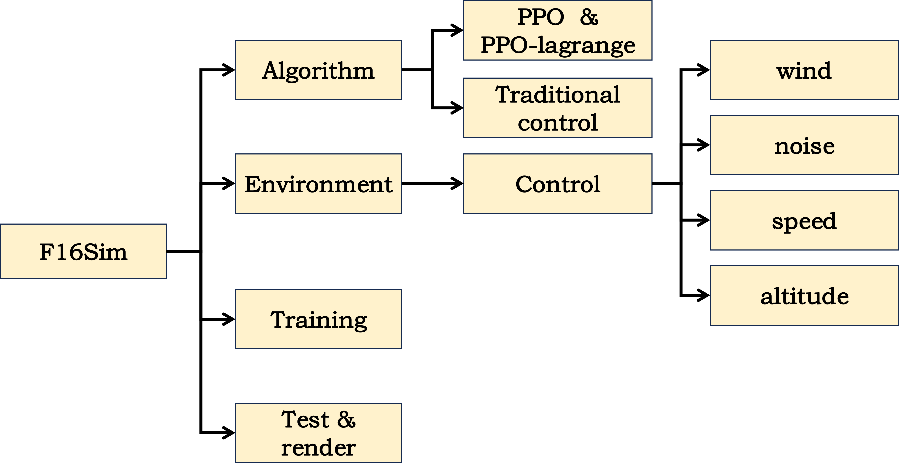
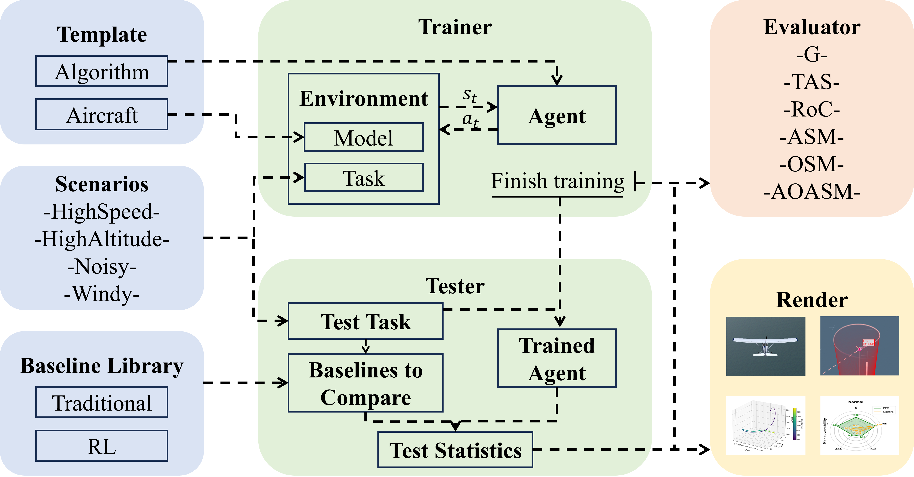

# NeuralPlane: An Efficiently Parallelizable Platform for Fixed-wing Aircraft Control with Reinforcement Learning (NeurIPS 2024)
## Introduction
We introduce NeuralPlane, the first benchmark platform for large-scale parallel simulations of fixed-wing aircraft. NeuralPlane significantly boosts high-fidelity simulation via GPU-accelerated Flight Dynamics Model (FDM) computation, achieving a single-step simulation time of just 0.2 seconds at a parallel scale of $10^6$ aircraft, far exceeding current platforms. We also provide clear code templates, comprehensive evaluation and visualization tools, and hierarchical frameworks for integrating RL and traditional control methods. We believe that NeuralPlane can accelerate the development of RL-based fixed-wing flight control and serve as a new challenging benchmark for the RL community.





***

## Install
```
git clone ......
cd NeuralPlane

# conda install
conda env create -f conda_env.yml

# pip install
pip install -r requirement.txt
```

***

## Envs
We provide four typical environments: control, planning, singlecombat and multiplecombat. Each environment supports different tasks, involving control, planning, and decision-making for fixed-wing aircraft. We can select the environment in  `scripts/train_*.sh`, by the parameter **env** to the selected environment.
- Control: Control env supports single agent Heading, Control and Tracking tasks, and is mainly focused on control for fixed-wing aircraft. The trained agent can be used to design baselines or become the low level policy of the following planning and decision-making tasks.
- Planning: Planning env supports single agent Heading, Control and Tracking tasks, and is mainly focused on planning for fixed-wing aircraft. Planning env is set with a fixed low-level control strategy for the aircraft. The algorithm plans flight behaviors, and the interaction frequency with the environment is lower than in Control env. The trained agent can be used to design baselines or become the low level policy of the following decision-making tasks.
- SingleCombat: SingleCombat env is for two agents 1v1 competitive tasks. The low level control use the model trained in Control env. 
- MultiCombat: MultiCombat env is for four agents nvn (n > 1) competitive tasks. The low level control use the model trained in Control env.

## Tasks
We provide all task configs in  `envs/configs`, each config corresponds to a task.

- Heading: The objective is to control the fixed-wing aircraft to reach a predetermined altitude, yaw angle, and speed within a specified time. This task serves as the foundation for multi-aircraft collaboration and pursuit tasks.
- Control: The objective is to control the fixed-wing aircraft to reach a predetermined pitch angle, yaw angle, and speed within a specified time. This task serves as the fundamental control basis for fixed-wing aircraft trajectory tracking.
- Tracking: The objective is to control the fixed-wing aircraft to reach a predetermined coordinate position (in the geocentric coordinate system) within a specified time.

## Models
We provide several classical fixed-wing aircraft dynamics models, such as the Cessna 172P and F16. It also features clear interfaces, enabling researchers to integrate their own fixed-wing aircraft models.

***

## How to Design Your Own Tasks
### Parameters
We provide clear parameters to design your own tasks based on the given task template, including Heading, Control and Tracking tasks. The parameters are described as follows. The parameters can be set in `envs/configs/*.yaml`.
| Parameter   | Type        | Description | Unit |
| ----------- | ----------- | ----------- | ---- |
| airspeed    | atmos config| the wind speed in the environment | feet/s |
| noise_scale | aircraft config | noise scale in aircraft sensing systems | |
| model | aircraft config | type of aircraft | |
| sim_freq | simulation config | frequency of agent interaction with the environment | Hz |
| num_agents | simulation config | the number of agents in the environment | |
| num_actions | simulation config | dimension of the action space | |
| num_observation | simulation config | dimension of the observation space | |
| max_steps | simulation config | maximum number of steps allowed by the environment | |
| max_pitch_increment | target config | maximum setting range for pitch targets | rad |
| max_heading_increment | target config | maximum setting range for yaw targets | rad |
| max_velocities_u_increment | target config | maximum setting range for velocity targets | feet/s |
| max_altitude_increment | target config | maximum setting range for velocity targets | feet/s |
| max_check_interval | target config
| min_check_interval | target config

***

## Quick Start
### Training

```bash
cd scripts
bash train_*.sh
```
We have provide scripts for five tasks in `scripts/`.

- `train_heading.sh` is for Heading task.
- `train_control.sh` is for Control task.
- `train_tracking.sh` is for Tracking task.
    
It can be adapted to other tasks by modifying a few parameter settings. 

- `--env` includes options ['Control', 'Planning', 'SingleCombat', 'MultipleCombat'].
- `--scenario` corresponds to yaml file in `envs/configs` one by one.
- `--algorithm` includes options [ppo, mappo].

The description of parameter setting refers to `config.py`.

### Evaluate and Render
```bash
cd renders
python render_*.py
```
This will generate a `*.acmi` file. We can use [**TacView**](https://www.tacview.net/), a universal flight analysis tool, to open the file and watch the render videos.

<!-- ## Citing
If you find this repo useful, pleased use the following citation:
````
@misc{liu2022light,
  author = {QihanLiu, Yuhua Jiang, Xiaoteng Ma},
  title = {Light Aircraft Game: A lightweight, scalable, gym-wrapped aircraft competitive environment with baseline reinforcement learning algorithms},
  year = {2022},
  publisher = {GitHub},
  journal = {GitHub repository},
  howpublished = {\url{https://github.com/liuqh16/CloseAirCombat}},
} -->
